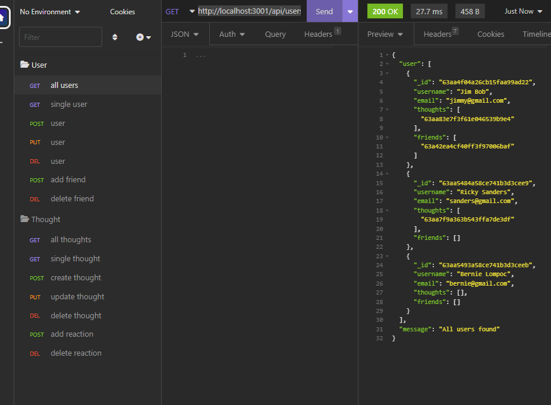
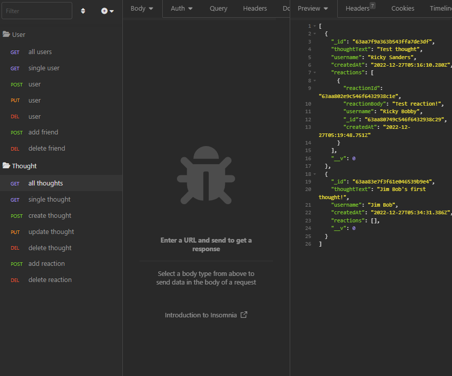
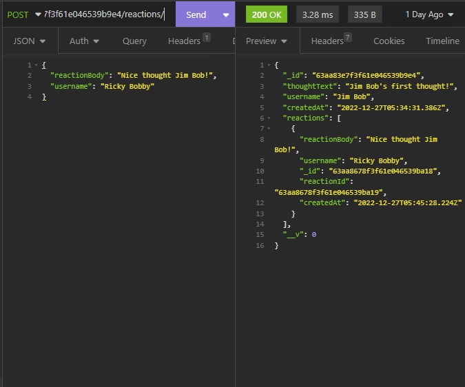

# NoSQL Social Network API

This basic social network API uses Mongodb, Express, Node, and Moment to create models/schemas for users, their thoughts, friends and reactions to said thoughts. The purpose of creating this backend API was to better understand how MongoDB schemas and models work, and too how to incoorperate Node with MongoDB. The motivation behind building this backend API was to get a better understanding of MongoDB and how to create seeds, schemas and models for MongoDB. This API also helped me develop a better idea of how to create basic backends with Mongo for a myriad of applications.

The most challenging part of creating this API backend was configuring the controllers for the thought and user requests/responses. Learning CRUD operations for a new database takes time, thankfully MongoDB is pretty friendly once you get a hang of it.

## Table of Contents
- [Usage/Examples](#usage)
- [Installation process](#installation-process)
- [Screenshots](#screenshots)
- [Deployed Project](#deployed-project)
- [Credits](#credits)
- [License](#license)

## Usage

For detailed instructions refer to this walkthrough video.
[Video Walkthrough](https://drive.google.com/file/d/1TU2wirSrC2B2DYUEJOGDSgD9euyL5pzx/view?usp=share_link)

## Installation process
For local use, this project requires the following steps: 
 * Have MongoDB installed and ensure that the route to your databases is properly configured in `connection.js` for local use.
 * Within your terminal run the command `npm i` to install the necessary packages
 * Run the server with `node server.js`
 * Use Insomnia for requests/responses to the server

## Screenshots

Here is an example response from the API for all users

Here is an example POST to the API for adding users' friends

Here is an example GET to the API for all thoughts

Here is an example POST to the API for adding reactions to a thought

# Deployed Project

* [Repository](https://github.com/skytexier/NoSQL-Social-Network-API)
* [Video Walkthrough](https://drive.google.com/file/d/1TU2wirSrC2B2DYUEJOGDSgD9euyL5pzx/view?usp=share_link)

## Credits

For this API I referred to previous works with Node and even MySQL for creating servers / connections to databases despite Mongo having a different database stucture. Similarly I referred back to class notes and examples for things such as schemas, models, controllers and so forth.

- A lot of stackoverflow for debugging [https://stackoverflow.com/](https://stackoverflow.com/)

- MongoDB Docs [https://www.mongodb.com/docs/](https://www.mongodb.com/docs/)

- ChatGPT for general questions about code snippets [https://openai.com/blog/chatgpt/](https://openai.com/blog/chatgpt/)

## License
MIT License
 
Copyright (c) [2022] [Sky Hamilton Texier]
 
Permission is hereby granted, free of charge, to any person obtaining a copy
of this software and associated documentation files (the "Software"), to deal
in the Software without restriction, including without limitation the rights
to use, copy, modify, merge, publish, distribute, sublicense, and/or sell
copies of the Software, and to permit persons to whom the Software is
furnished to do so, subject to the following conditions:
 
The above copyright notice and this permission notice shall be included in all
copies or substantial portions of the Software.
 
THE SOFTWARE IS PROVIDED "AS IS", WITHOUT WARRANTY OF ANY KIND, EXPRESS OR
IMPLIED, INCLUDING BUT NOT LIMITED TO THE WARRANTIES OF MERCHANTABILITY,
FITNESS FOR A PARTICULAR PURPOSE AND NONINFRINGEMENT. IN NO EVENT SHALL THE
AUTHORS OR COPYRIGHT HOLDERS BE LIABLE FOR ANY CLAIM, DAMAGES OR OTHER
LIABILITY, WHETHER IN AN ACTION OF CONTRACT, TORT OR OTHERWISE, ARISING FROM,
OUT OF OR IN CONNECTION WITH THE SOFTWARE OR THE USE OR OTHER DEALINGS IN THE
SOFTWARE.

 
